# CLAUDE.md

> Changelog (2026-04-10 09:10): Deep scan round 3 complete -- Athletes pages (Athletes.tsx, AthleteProfile.tsx), Utils module (11 files, 6 subdirs), Config module (7 tool configs) all documented. Module index expanded to 17 modules. Mermaid diagram updated.

---

This file provides guidance to Claude Code (claude.ai/code) when working with code in this repository.

## Project Vision

A web platform for managing sport stacking (cup stacking) tournaments and tracking athlete rankings and best times globally. Targets tournament organizers, athletes, and coaches. Deployed on Firebase Hosting with a Cloud Functions backend.

---

## Architecture Overview

```
SportStackingWebsite/
├── src/                          # Vite React frontend (workspace root)
│   ├── App.tsx                    # Root component, router, layout wrapper
│   ├── main.tsx                   # Entry point
│   ├── config/routes.tsx          # Route definitions (27+ routes)
│   ├── context/AuthContext.tsx    # Firebase Auth + Firestore user state
│   ├── components/                # Reusable UI components
│   │   ├── common/                # AvatarUploader, Login, ProtectedRoute
│   │   └── layout/                # Navbar, Footer
│   ├── hooks/                     # Custom hooks + barrel re-export
│   │   └── DateHandler/           # Smart date handlers for tournament forms
│   ├── pages/                     # Route-level page components
│   │   ├── Home/                  # Homepage with carousel + banners
│   │   ├── Athletes/              # Athlete directory + profile
│   │   ├── Records/               # Global records/rankings page
│   │   ├── Tournaments/           # Full tournament lifecycle
│   │   │   ├── Component/          # TournamentList, TournamentView, shared editors
│   │   │   ├── Scoring/           # ScoringPage, FinalScoringPage
│   │   │   ├── ScoreSheet/        # Public shareable score sheet
│   │   │   ├── PrintResults/      # PDF export/print results
│   │   │   ├── PrelimResults/     # Prelim results display
│   │   │   ├── FinalResults/      # Final results display
│   │   │   ├── RegisterTournaments/
│   │   │   ├── RegistrationsList/
│   │   │   ├── VerifyMember/
│   │   │   ├── ParticipantList/
│   │   │   └── CreateTournaments/
│   │   ├── Admin/                 # Admin panels (permissions, users, carousel, recruitment)
│   │   └── User/                  # Auth (register, forgot password, profile)
│   ├── schema/                    # Zod validation schemas (27 schemas)
│   ├── services/firebase/         # Firestore service layer (19 service files)
│   ├── services/auth/             # Auth UI components
│   └── utils/                     # Utility functions (PDF, date, device, tournament, etc.)
├── functions/                     # Firebase Cloud Functions (Node.js 22, TypeScript)
│   └── src/index.ts               # All cloud functions (email, best times, history sync)
└── config/                        # Tooling configs (Biome, ESLint, Tailwind, Vite, PostCSS)
```

---

## Module Structure

```mermaid
graph TD
    A["(Root) SportStackingWebsite"] --> B["Frontend App (src/)"];
    A --> C["Cloud Functions (functions/)"];
    A --> D["Tooling Config (config/)"];

    B --> E["App Core"];
    B --> F["Tournaments"];
    B --> G["Athletes & Records"];
    B --> H["Admin"];
    B --> I["Auth"];
    B --> J["Services Layer"];
    B --> K["Components"];
    B --> L["Hooks"];
    B --> M["Utils"];

    E --> E1["Routes & Layout"];
    E --> E2["Auth Context"];
    E --> E3["Firebase Config"];

    F --> F1["Tournament Management"];
    F --> F2["Registration & Verification"];
    F --> F3["Scoring & Records"];
    F --> F4["PDF Export & Print"];

    G --> G1["Athlete Rankings (Athletes.tsx)"];
    G --> G2["Athlete Profile"];
    G --> G3["Best Times Service"];
    G --> G4["Records Aggregation"];

    H --> H1["User Management"];
    H --> H2["Carousel Management"];
    H --> H3["Team Recruitment Admin"];
    H --> H4["Developer Settings"];

    I --> I1["Auth Service"];
    I --> I2["Register/Login/Forgot Password"];

    J --> J1["Record Service (19 files)"];
    J --> J2["Share Result Service"];
    J --> J3["Verification Service"];

    K --> K1["Login (OAuth + Email)"];
    K --> K2["Avatar Uploader"];
    K --> K3["Protected Route"];
    K --> K4["Navbar + Footer"];

    L --> L1["DeviceInspector Hooks"];
    L --> L2["Smart Date Handlers"];

    M --> M1["Result Aggregation"];
    M --> M2["Event Utilities"];
    M --> M3["PDF Export (13 functions)"];
    M --> M4["Device Store"];
    M --> M5["Time/Country/Gender Formatters"];
    M --> M6["Validation"];

    C --> C1["Email (Resend + AWS SES)"];
    C --> C2["Best Times Cloud Sync"];
    C --> C3["History Aggregation"];
    C --> C4["Avatar Caching"];

    click E1 "./src/config/CLAUDE.md" "View Routes & Layout module"
    click E2 "./src/context/CLAUDE.md" "View Auth Context module"
    click E3 "./src/services/firebase/config.ts" "View Firebase Config"
    click F "./src/pages/Tournaments/CLAUDE.md" "View Tournaments module"
    click F3 "./src/pages/Tournaments/Scoring/CLAUDE.md" "View Scoring module"
    click G "./src/pages/Records/CLAUDE.md" "View Athletes & Records module"
    click G1 "./src/pages/Records/CLAUDE.md" "View Athletes Directory page"
    click G2 "./src/pages/Records/CLAUDE.md" "View Athlete Profile page"
    click H "./src/pages/Admin/CLAUDE.md" "View Admin module"
    click I "./src/services/firebase/authService.ts" "View Auth module"
    click J1 "./src/services/firebase/CLAUDE.md" "View Services module"
    click K1 "./src/components/CLAUDE.md" "View Components module"
    click L1 "./src/hooks/CLAUDE.md" "View Hooks module"
    click M "./src/utils/CLAUDE.md" "View Utilities module"
    click M3 "./src/utils/CLAUDE.md" "View PDF Export utilities"
    click C "./functions/CLAUDE.md" "View Cloud Functions module"
```



---

## Module Index

| Module | Path | Language | Entry / Interface | Tests | Schemas | Description |
|--------|------|----------|-------------------|-------|---------|-------------|
| **Routes & Layout** | `src/config/`, `src/components/layout/` | TSX | `routes.tsx`, `App.tsx` | -- | -- | 27+ SPA routes, Navbar, Footer, ProtectedRoute |
| **Auth Context** | `src/context/AuthContext.tsx` | TSX | `AuthContext.tsx` | -- | -- | Firebase Auth + Firestore user state management |
| **Firebase Config** | `src/services/firebase/config.ts` | TS | `config.ts` | -- | -- | Firebase SDK init, App Check (ReCAPTCHA v3), multi-DB support |
| **Tournaments** | `src/pages/Tournaments/` | TSX | `Tournaments.tsx`, `CreateTournaments/` | -- | `TournamentSchema.ts` | Full tournament lifecycle: create, register, score, results |
| **Scoring & Results** | `src/pages/Tournaments/Scoring/` | TSX | `ScoringPage.tsx`, `FinalScoringPage.tsx` | -- | `RecordSchema.ts` | Real-time scoring (prelim/final), results aggregation, PDF export, public score sheet |
| **Registration & Verification** | `src/pages/Tournaments/RegisterTournaments/`, `VerifyMember/` | TSX | `RegisterTournament.tsx`, `VerifyPage.tsx` | -- | `RegistrationSchema.ts`, `VerificationRequestSchema.ts` | Tournament registration, team invitation, verification flow |
| **Athletes & Records** | `src/pages/Athletes/`, `src/pages/Records/`, `src/services/firebase/` | TSX/TS | `Athletes.tsx`, `AthleteProfile.tsx`, `Records/index.tsx`, `athleteRankingsService.ts` | -- | `RecordSchema.ts`, `AthleteRankingSchema.ts` | Athlete directory (rankings table), profile page, global records, best time aggregation |
| **Admin** | `src/pages/Admin/` | TSX | `UserManagement.tsx`, `CarouselManagement.tsx`, `TeamRecruitmentManagement.tsx`, `AdminPermission.tsx`, `DeveloperSetting.tsx` | -- | `RoleSchema.ts`, `HomeCarouselSchema.ts` | User role management, user CRUD, home carousel, team recruitment admin, global recalculation |
| **Services Layer** | `src/services/firebase/` | TS/JS | 19 service files | -- | -- | Firestore data access layer (auth, tournaments, records, registration, verification, storage, rankings) |
| **Components** | `src/components/` | TSX | `Login.tsx`, `Navbar.tsx`, `Footer.tsx`, `AvatarUploader.tsx`, `ProtectedRoute.tsx` | -- | -- | Auth modal, site chrome, avatar upload, route guard |
| **Hooks** | `src/hooks/` | TS/JS | `index.js` (barrel), `useSmartDateHandlers.ts` | -- | -- | Device breakpoint hooks (from utils), smart date range handlers for tournament forms |
| **Utilities** | `src/utils/` | TS/TSX | `resultAggregation.ts`, `eventUtils.ts`, `pdfExport.ts`, `DeviceInspector/`, etc. | -- | -- | 11 utility files: scoring aggregation, event matching, PDF export (13 functions), device breakpoints, time/country/gender formatters, team helpers, validation |
| **Auth Pages** | `src/pages/User/` | TSX | `RegisterPage.tsx`, `ForgotPasswordPage.tsx`, `UserProfile.tsx` | -- | `AuthSchema.ts` | Registration, password recovery, profile management |
| **Cloud Functions** | `functions/src/index.ts` | TS | `index.ts` | -- | -- | Email (Resend+AWS SES), best times sync, history aggregation, avatar cache |
| **Best Times Service** | `src/services/firebase/userBestTimesService.ts` | TS | `userBestTimesService.ts` | -- | -- | Client-side best time tracking with season labeling |
| **Schemas** | `src/schema/` | TS | `schema/index.ts` (barrel) | -- | 27 Zod schemas | All data validation (tournaments, users, records, scoring, etc.) |
| **Tooling Config** | `config/` | JS/JSON | `index.js` (barrel) | -- | -- | Biome, ESLint, Tailwind, Vite, PostCSS, Firebase, Prettier configs |

---

## Running & Development

### Frontend (Vite)
```bash
yarn dev          # Dev server on port 5000
yarn build        # Production build to dist/
yarn preview      # Preview production build
yarn typecheck    # tsc --noEmit
yarn check        # Biome lint check
yarn lint         # Biome lint
yarn format       # Biome format
yarn fix          # Biome auto-fix
yarn validate     # typecheck + lint
yarn setup        # install-extensions.sh + yarn
```

### Cloud Functions
```bash
cd functions
yarn build        # Compile TypeScript to lib/
yarn serve        # Firebase emulators (functions only)
yarn deploy       # firebase deploy --only functions
yarn logs         # firebase functions:log
```

### Environment Variables (required for frontend)
```
VITE_FIREBASE_API_KEY
VITE_FIREBASE_AUTH_DOMAIN
VITE_FIREBASE_PROJECT_ID
VITE_FIREBASE_STORAGE_BUCKET
VITE_FIREBASE_MESSAGING_SENDER_ID
VITE_FIREBASE_APP_ID
VITE_FIREBASE_MEASUREMENT_ID
VITE_FIREBASE_DATABASE_ID        # Optional, for multi-DB support
VITE_FIREBASE_FUNCTIONS_REGION    # Optional, default: asia-southeast1
```

### Firebase Secrets (for functions)
```
RESEND_API_KEY
AWS_SES_SMTP_USERNAME
AWS_SES_SMTP_PASSWORD
```

---

## Testing Strategy

**Status: NO automated tests found.**

- No unit tests, no integration tests, no E2E tests
- Manual testing only via CI/CD deployment pipeline
- **Coverage target: 80%** per project rules -- **currently 0%**

**Recommended additions:**
1. Unit tests for all services (`src/services/firebase/*.ts`) -- use Vitest or Jest
2. Integration tests for Firestore operations -- use firebase-functions-test
3. E2E tests for critical flows (register, tournament create, scoring, verification) -- use Playwright
4. Zod schema validation tests

---

## Key Data Models (Firestore Collections)

| Collection | Purpose | Key Fields |
|-----------|---------|-----------|
| `users` | Athletes & members | `global_id`, `best_times`, `roles`, `registration_records`, `birthdate`, `country`, `gender` |
| `tournaments` | Tournament records | `name`, `status`, `events[]`, `age_brackets[]`, `payment_methods[]`, `editor`, `recorder` |
| `registrations` | Tournament signups | `user_global_id`, `tournament_id`, `events_registered`, `status` |
| `teams` | Team records | `leader_id`, `members[]`, `event_id`, `tournament_id` |
| `records` | Final individual/team results | `participant_global_id`, `tournament_id`, `event`, `code`, `best_time`, `classification` |
| `prelim_records` | Preliminary results | Same as records, `classification: "prelim"` |
| `overall_records` | Overall (sum of 3 events) | `participant_global_id`, `three_three_three`, `three_six_three`, `cycle`, `overall_time` |
| `team_recruitment` | Team recruitment listings | `tournament_id`, `leader_id`, `participant_id` |
| `individual_recruitment` | Individual recruitment listings | `tournament_id`, `participant_id` |
| `double_recruitment` | Double pairing recruitment | `tournament_id`, `participant_id`, `partner_id` |
| `verification_requests` | Team membership verification | `target_global_id`, `tournament_id`, `team_id`, `status` |
| `user_tournament_history` | Cached aggregated history | `globalId`, `tournaments[]`, `recordCount` |
| `homeCarousel` | Homepage banner images | `imageUrl`, `title`, `description`, `link`, `isActive` (camelCase collection name) |
| `events` | Tournament event definitions | `tournament_id`, `type`, `codes[]`, `gender`, `age_brackets[]` |
| `finalists` | Finalist group assignments | `tournament_id`, `bracket_name`, `event_type`, `participant_ids[]`, `classification` |

### Event Types
- `3-3-3` -- 3-3-3 individual stack
- `3-6-3` -- 3-6-3 individual stack
- `Cycle` -- Full cycle (3-6-3 then back to 3-3-3)
- `Overall` -- Sum of 3-3-3 + 3-6-3 + Cycle times

### Tournament Classifications
- `prelim` -- Preliminary round
- `advance` -- Advance/Championship division
- `intermediate` -- Intermediate division
- `beginner` -- Beginner division

---

## Coding Standards

- **Immutability**: Always create new objects, never mutate existing state
- **File size**: Target 200-400 lines, max 800 lines
- **Naming**: PascalCase (components/interfaces), camelCase (variables/functions), kebab-case (CSS classes)
- **Validation**: Zod schemas for all data at system boundaries; no `any` types
- **Error handling**: Explicit error handling with user-friendly messages in UI, detailed context in services
- **Secrets**: Never hardcode -- use Firebase Secrets Manager and `import.meta.env`
- **TS/JS mix**: Some files are `.js` (legacy) -- `src/hooks/index.js` and `src/services/firebase/recordService.js` are bridges

---

## AI Usage Guidance

### When to Use Agents
- **planner** -- Complex features, architectural decisions
- **tdd-guide** -- Before writing any new service or page
- **code-reviewer** -- After writing any page component or service
- **security-reviewer** -- Before any auth, payment, or Firestore security rule changes
- **build-error-resolver** -- When `yarn build` fails

### Critical Security Notes
- **Firestore rules are open** (`allow read, write: if true`) -- **This is a CRITICAL security gap.** Any authenticated Firebase user can read/write ALL data.
- Auth functions use Firebase App Check (ReCAPTCHA v3) for protection
- Cloud Functions endpoints require valid Firebase ID tokens
- AWS SES credentials managed via Firebase Secrets Manager

---

## Known Issues & Recommendations

1. **Firestore security rules are wide-open** -- CRITICAL: implement proper read/write rules per collection
2. **No test coverage** -- 0% coverage; needs unit, integration, and E2E tests
3. **Firestore `allow write: if true`** means any authenticated user can overwrite any document
4. **Team event conflict detection** only in Cloud Functions; client-side has no protection
5. **No rate limiting** on Cloud Functions endpoints
6. **`homeCarousel` collection name** is camelCase (not `home_carousel`) -- inconsistency with other collections
7. **Developer ID hardcoded** (`global_id === "00001"`) in DeveloperSetting page
8. **`firestoreService.tsx`** is a 1-line empty placeholder file -- appears unused
9. **`pdfExport.ts` uses `@ts-nocheck`** -- large file (~2044 lines) bypasses type checking

---

## Change Log (Changelog)

| Date | Change |
|------|--------|
| 2026-04-10 | Initial comprehensive scan. Root CLAUDE.md created with full module index, Mermaid diagram, data models, coverage gaps, and security warnings. |
| 2026-04-10 09:10 | Deep scan round 2: Admin (5 pages), Scoring module (ScoringPage, FinalScoringPage, ScoreSheetPage, PrintResultsPage, PrelimResultsPage, FinalResultsPage), Services (19 files), Components, Hooks all documented. Module index expanded to 15 modules. Mermaid diagram updated. Known issues expanded. |
| 2026-04-10 09:10 | Deep scan round 3: Athletes pages (Athletes.tsx, AthleteProfile.tsx deep-scanned), Utils module (11 files in 6 subdirs documented), Config module (7 tool configs documented). Module index expanded to 17 modules. Mermaid diagram updated with Utils sub-modules. |
