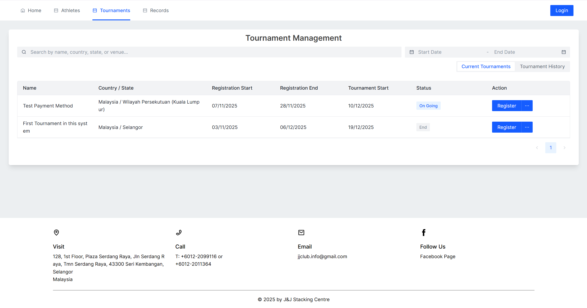
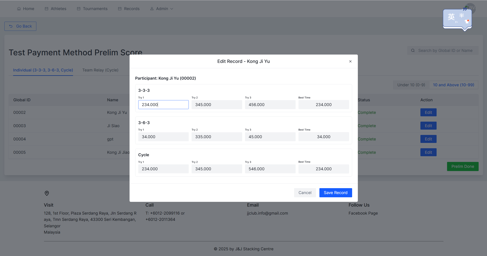
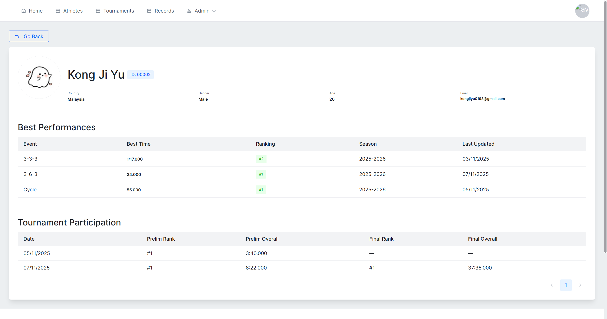
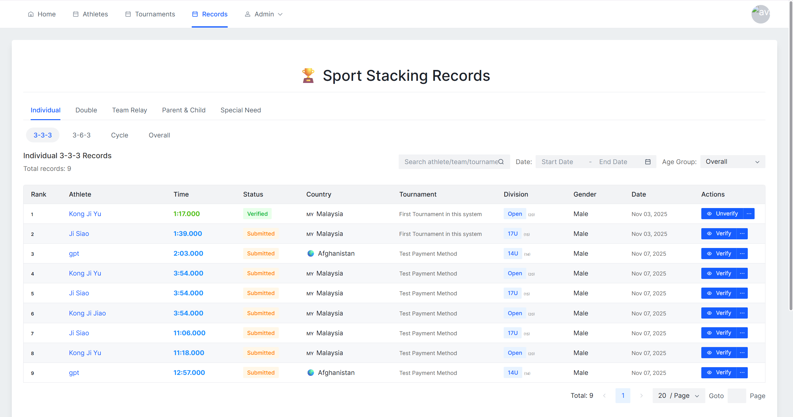
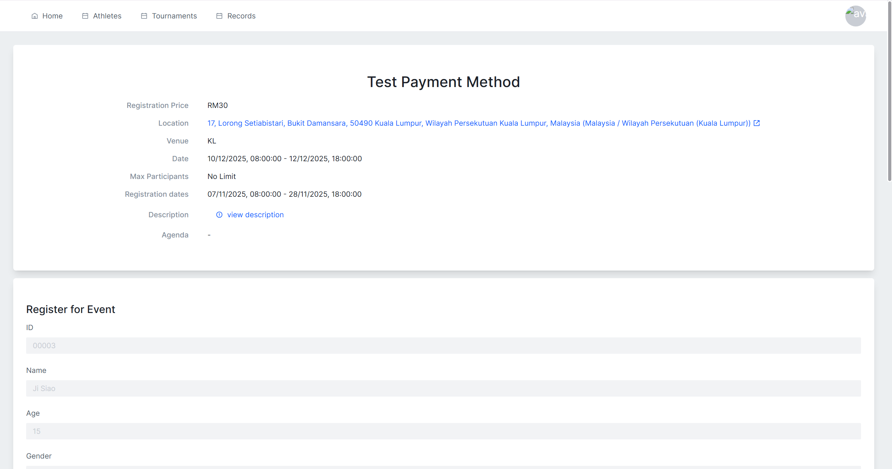
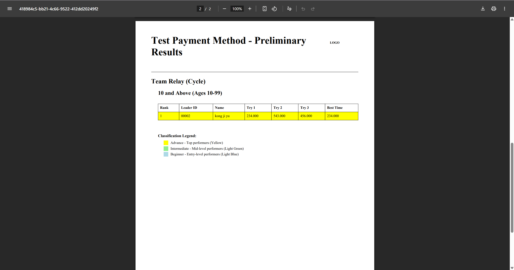
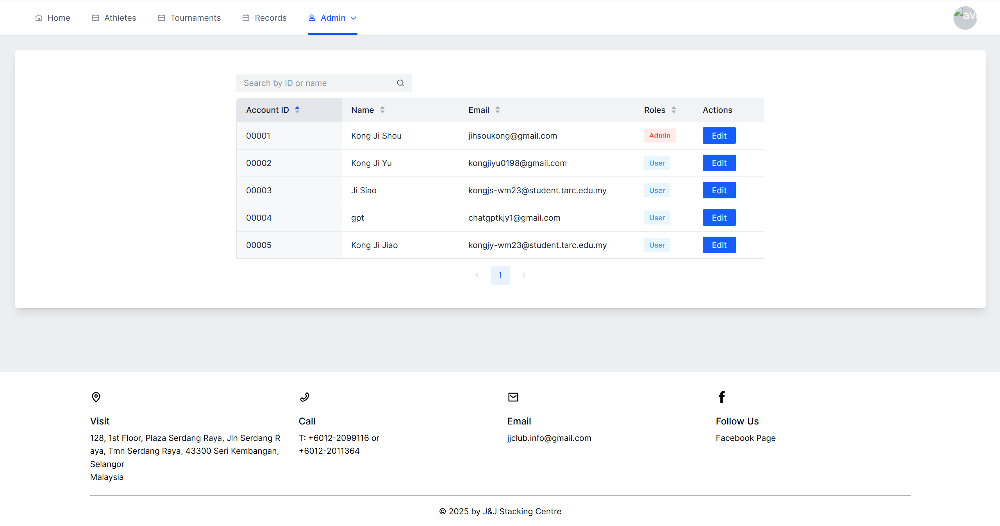
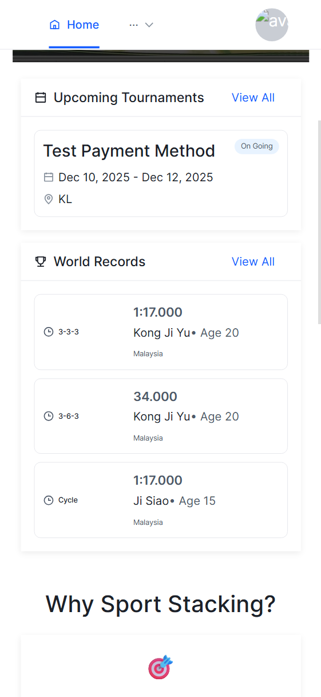

# 🥇 Sport Stacking Website

A comprehensive web application for managing sport stacking tournaments, athlete profiles, and competition records. Built with modern web technologies to provide a seamless experience for tournament organizers, athletes, and administrators.

**[中文版 README](README.zh-TW.md)** | **[English Version](README.md)**

<!-- Add main website screenshot here -->


---

## ✨ Features

### 🏆 Tournament Management
*   **Create Tournaments**: Set up tournaments with multiple events (Individual 3-3-3, 3-6-3, Cycle, Team 3-6-3, Doubles)
*   **Bracket Configuration**: Customize age brackets and gender divisions
*   **Classification System**: Organize finals into Advanced, Intermediate, and Beginner levels

<!-- Add tournament management screenshot here -->


### 📊 Scoring System
*   **Preliminary Scoring**: Record preliminary round times with automatic qualification
*   **Final Scoring**: Manage multi-level finals across different classifications
*   **Real-time Rankings**: Automatic ranking updates based on performance
*   **Color-Coded Classifications**: Visual indicators for different qualification levels

<!-- Add scoring interface screenshot here -->


### 👤 Athlete Management
*   **Athlete Profiles**: Comprehensive profiles with personal bests and competition history
*   **Global ID System**: Unique identification for each athlete across tournaments
*   **Performance Tracking**: Track athlete progress across multiple events and seasons
*   **Avatar Upload**: Personalized profile pictures

<!-- Add athlete profile screenshot here -->


### 📈 Records & Rankings
*   **Event Records**: Track records for all sport stacking disciplines
*   **Bracket-based Rankings**: Separate rankings by age group and gender
*   **Historical Data**: Complete tournament history for each athlete
*   **Best Times**: Automatic tracking of personal and tournament bests

<!-- Add records page screenshot here -->


### 📝 Registration System
*   **Online Registration**: Easy participant registration for tournaments
*   **Multiple Events**: Register for multiple events simultaneously
*   **Team Management**: Create and manage team rosters
*   **Registration Validation**: Automatic validation of participant information

<!-- Add registration form screenshot here -->


### 📄 PDF Export
*   **Results Export**: Generate professional PDF reports of tournament results
*   **Classification Legends**: Color-coded legends explaining qualification levels
*   **Complete Brackets**: Export all brackets and classifications

<!-- Add PDF export sample here -->


### 🔐 User Authentication
*   **Secure Login**: Firebase Authentication for secure access
*   **Role-based Access**: Different permission levels for users, organizers, and admins
*   **Protected Routes**: Secure pages requiring authentication

### 🎯 Admin Dashboard
*   **User Management**: Manage user roles and permissions
*   **Carousel Management**: Update homepage carousel images
*   **Team Recruitment**: Manage team recruitment posts
*   **Site Settings**: Configure global application settings

<!-- Add admin dashboard screenshot here -->


### 📱 Responsive Design
*   **Mobile Optimized**: Fully responsive layout for all devices
*   **Touch-friendly**: Optimized for touch interactions
*   **Cross-browser**: Compatible with all modern browsers

<!-- Add responsive design showcase here -->


---

## 🚀 Tech Stack

### Frontend

| Category | Technology | Description |
| --- | --- | --- |
| **UI Framework** | [React 18](https://reactjs.org/) | Modern component-based library |
| **Build Tool** | [Vite](https://vitejs.dev/) | Lightning-fast dev server & bundler |
| **Type System** | [TypeScript](https://www.typescriptlang.org/) | Static type checking |
| **UI Components** | [Arco Design React](https://arco.design/) | Enterprise-level UI component library |
| **Routing** | [React Router v6](https://reactrouter.com/) | Declarative routing |
| **State Management** | [Jotai](https://jotai.org/) | Primitive and flexible state management |

### Styling

| Category | Technology | Description |
| --- | --- | --- |
| **CSS Framework** | [Tailwind CSS](https://tailwindcss.com/) | Utility-first CSS framework |
| **CSS Preprocessor** | SCSS | Enhanced CSS with variables & nesting |
| **PostCSS** | [PostCSS](https://postcss.org/) | CSS transformation tool |

### Form & Validation

| Category | Technology | Description |
| --- | --- | --- |
| **Form Handling** | [React Hook Form](https://react-hook-form.com/) | Performant form validation |
| **Schema Validation** | [Zod](https://zod.dev/) | TypeScript-first schema validation |

### Backend & Services

| Category | Technology | Description |
| --- | --- | --- |
| **Backend as a Service** | [Firebase](https://firebase.google.com/) | Complete backend solution |
| **Database** | [Cloud Firestore](https://firebase.google.com/docs/firestore) | NoSQL cloud database |
| **Authentication** | [Firebase Auth](https://firebase.google.com/docs/auth) | Secure user authentication |
| **Cloud Functions** | [Firebase Functions](https://firebase.google.com/docs/functions) | Serverless backend logic |
| **Hosting** | [Firebase Hosting](https://firebase.google.com/docs/hosting) | Fast and secure web hosting |
| **Storage** | [Firebase Storage](https://firebase.google.com/docs/storage) | File storage and serving |

### PDF Generation

| Category | Technology | Description |
| --- | --- | --- |
| **PDF Library** | [jsPDF](https://github.com/parallax/jsPDF) | Client-side PDF generation |
| **Table Plugin** | jsPDF-AutoTable | Automatic table generation for PDFs |

### Development Tools

| Category | Technology | Description |
| --- | --- | --- |
| **Code Quality** | [Biome](https://biomejs.dev/) | Fast formatter and linter |
| **Linting** | [ESLint](https://eslint.org/) | Pluggable JavaScript linter |
| **Formatting** | [Prettier](https://prettier.io/) | Opinionated code formatter |
| **Package Manager** | [Yarn](https://yarnpkg.com/) | Fast and reliable dependency management |

### Additional Libraries

| Category | Technology | Description |
| --- | --- | --- |
| **Date Handling** | Custom hooks | Smart date handlers for tournaments |
| **Icons** | [Arco Design Icons](https://arco.design/react/components/icon) | Icon library |
| **Notifications** | Arco Message & Notification | Toast notifications |

---

## 📦 Available Scripts

### Development

| Script | Description |
| --- | --- |
| `yarn dev` | Start the development server |
| `yarn build` | Build the project for production |
| `yarn preview` | Preview the production build |

### Code Quality

| Script | Description |
| --- | --- |
| `yarn typecheck` | Run TypeScript type checking |
| `yarn lint` | Lint files using Biome |
| `yarn format` | Format files using Biome |
| `yarn fix` | Auto-fix linting issues using Biome |
| `yarn validate` | Run both type checking and linting |

### Cloud Functions

| Script | Description |
| --- | --- |
| `yarn workspace functions build` | Build Cloud Functions |
| `yarn workspace functions serve` | Run Functions emulator locally |
| `yarn workspace functions deploy` | Deploy Functions to Firebase |

---

## 🏁 Getting Started

### Prerequisites

*   [Node.js](https://nodejs.org/) (v18 or higher)
*   [Yarn](https://yarnpkg.com/) - Package manager
*   A [Firebase](https://firebase.google.com/) project

### Installation

1.  **Clone the repository:**
    ```bash
    git clone https://github.com/KJiShou/Sport-Stacking-Website.git
    cd Sport-Stacking-Website
    ```

2.  **Install dependencies:**
    ```bash
    yarn
    ```

3.  **Set up Firebase:**
    *   Create a `.env` file in the root of the project
    *   Add your Firebase project configuration to the `.env` file
    *   You can get this from the Firebase console
    *   Path: `Project settings > General > Your apps > Web app`

    ```env
    VITE_API_KEY=your-api-key
    VITE_AUTH_DOMAIN=your-auth-domain
    VITE_PROJECT_ID=your-project-id
    VITE_STORAGE_BUCKET=your-storage-bucket
    VITE_MESSAGING_SENDER_ID=your-messaging-sender-id
    VITE_APP_ID=your-app-id
    ```

4.  **Run the development server:**
    ```bash
    yarn dev
    ```
    The application will be available at `http://localhost:5173`

5.  **Build and deploy Cloud Functions:**
    ```bash
    cd functions
    yarn build
    yarn deploy
    ```

6.  **Return to development:**
    ```bash
    cd ..
    yarn dev
    ```

---

## 📂 Project Structure

```
/
├── public/                      # Static assets
│   ├── robots.txt              # SEO robots file
│   ├── sitemap.xml             # Site map
│   └── images/                 # Public images
│
├── src/
│   ├── assets/                 # Images, icons, etc.
│   │   └── icon.avif           # Application icon
│   │
│   ├── components/             # Reusable React components
│   │   ├── common/             # Common components
│   │   │   ├── AvatarUploader.tsx    # Avatar upload component
│   │   │   ├── Login.tsx             # Login component
│   │   │   └── ProtectedRoute.tsx    # Route protection
│   │   └── layout/             # Layout components
│   │       ├── Navbar.tsx            # Navigation bar
│   │       └── Footer.tsx            # Footer
│   │
│   ├── config/                 # Application configuration
│   │   └── routes.tsx          # Route definitions
│   │
│   ├── constants/              # Constant values
│   │   └── tournamentDefaults.ts     # Tournament defaults
│   │
│   ├── context/                # React context providers
│   │   └── AuthContext.tsx     # Authentication context
│   │
│   ├── hooks/                  # Custom React hooks
│   │   └── DateHandler/        # Date handling hooks
│   │       └── useSmartDateHandlers.ts
│   │
│   ├── pages/                  # Page components
│   │   ├── Admin/              # Admin pages
│   │   │   ├── AdminPermission.tsx          # Permission management
│   │   │   ├── CarouselManagement.tsx       # Carousel management
│   │   │   └── TeamRecruitmentManagement.tsx # Team recruitment
│   │   ├── Athletes/           # Athlete pages
│   │   ├── Home/               # Home page
│   │   ├── Records/            # Records pages
│   │   ├── Tournaments/        # Tournament pages
│   │   │   ├── Scoring/        # Scoring interface
│   │   │   ├── FinalResults/   # Final results
│   │   │   └── Component/      # Tournament components
│   │   └── User/               # User pages
│   │
│   ├── schema/                 # Zod schemas for validation
│   │   ├── TournamentSchema.ts        # Tournament schema
│   │   ├── RecordSchema.ts            # Record schema
│   │   ├── UserProfileSchema.ts       # User profile schema
│   │   ├── AuthSchema.ts              # Authentication schema
│   │   └── ...                        # Other schemas
│   │
│   ├── services/               # Services for APIs
│   │   └── firebase/           # Firebase services
│   │       ├── recordService.ts       # Record operations
│   │       ├── athleteService.ts      # Athlete operations
│   │       ├── userHistoryService.ts  # User history
│   │       └── ...                    # Other services
│   │
│   ├── types/                  # TypeScript type definitions
│   │
│   ├── utils/                  # Utility functions
│   │   ├── PDF/                # PDF utilities
│   │   │   └── pdfExport.ts    # PDF export functions
│   │   ├── Date/               # Date utilities
│   │   ├── tournament/         # Tournament utilities
│   │   └── ...                 # Other utilities
│   │
│   ├── App.tsx                 # Main App component
│   ├── main.tsx                # Entry point
│   ├── firebaseConfig.js       # Firebase configuration
│   └── global.scss             # Global styles
│
├── functions/                  # Firebase Cloud Functions
│   ├── src/
│   │   ├── index.ts            # Functions entry point
│   │   └── schema/             # Function schemas
│   ├── lib/                    # Compiled output
│   ├── package.json            # Functions dependencies
│   └── tsconfig.json           # TypeScript config
│
├── config/                     # Configuration files
│   ├── biome/                  # Biome config
│   ├── eslint/                 # ESLint config
│   ├── firebase/               # Firebase config
│   ├── prettier/               # Prettier config
│   ├── tailwind/               # Tailwind config
│   └── vite/                   # Vite config
│
├── firebase.json               # Firebase configuration
├── firestore.rules             # Firestore security rules
├── firestore.indexes.json      # Firestore indexes
├── vite.config.js              # Vite configuration
├── tailwind.config.js          # Tailwind configuration
├── biome.json                  # Biome configuration
├── package.json                # Project dependencies
└── tsconfig.json               # TypeScript configuration
```

---

## 🎨 Key Features Implementation

### Classification System

The tournament system supports a sophisticated classification mechanism:

- **Preliminary Round**: All participants compete (`prelim`)

- **Final Classifications**:
  - **Advanced** (`advance`): Top performers
  - **Intermediate** (`intermediate`): Mid-level competitors
  - **Beginner** (`beginner`): Entry-level finals

---

## 🤝 Contributing

Contributions are welcome! Please feel free to submit a Pull Request.

### Development Guidelines

1. Follow the coding style defined in `biome.json`

2. Run `yarn validate` before committing

3. Use TypeScript for all new code

4. Add appropriate Zod schemas for data validation

5. Follow the project structure conventions

---

## 📝 License

This project is licensed under the MIT License - see the [LICENSE](LICENSE) file for details.

---

## 👥 Authors

- **KJiShou** - [GitHub Profile](https://github.com/KJiShou)

---

## 🙏 Acknowledgments

- Thanks to all contributors who have helped this project grow

- Built with modern web technologies and best practices

- Special thanks to the sport stacking community

---

## 📧 Contact

For questions or support, please open an issue on GitHub.

---

<div align="center">

**Made with ❤️ for the Sport Stacking Community**

</div>
